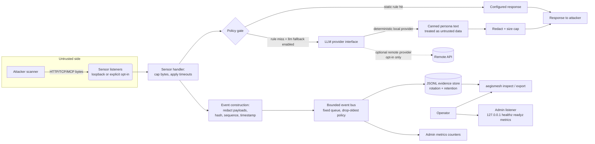
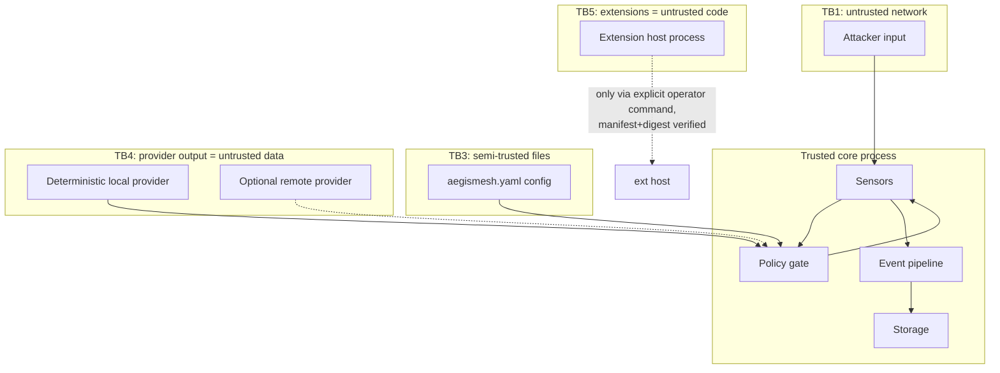
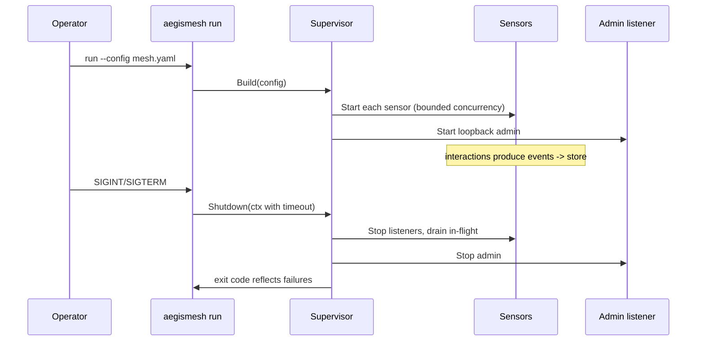

# Architecture and data flow

Version: 0.1.0. Single Go module `github.com/metaforismo/aegismesh`, single binary `aegismesh`.

## Component map

```text
cmd/aegismesh          entrypoint; wires config -> runtime -> admin -> cli
internal/cli           command dispatch, output rendering (human/JSON), errors
internal/config        schema-versioned load/validate/env-override/migrate hooks
internal/runtime       supervisor: sensor lifecycle, bounded event bus, graceful shutdown
internal/sensor        Sensor interface + registry
  /httpsensor          HTTP deception sensor (net/http, hardened server)
  /tcpsensor           TCP deception sensor (banner + line protocol)
  /mcpsensor           MCP decoy endpoint (JSON-RPC 2.0 over streamable HTTP POST)
internal/policy        response policy gate: static rules, provider fallback, redaction choke point
internal/llm           Provider interface + deterministic local provider (+ adapter seam for real ones)
internal/event         versioned envelope, redaction, integrity hashing, bounded bus
internal/storage       JSONL append-only store, rotation, retention, export
internal/admin         loopback listener: /healthz /readyz /metrics /version
internal/ext           extension manifest schema, digest/signature verifier, subprocess host
internal/migrate       clean-room importers (beelzebub YAML shapes)
```

## Runtime data flow



## Trust boundary diagram



## Lifecycle



## Invariants (enforced in code)

1. Every sensor response originates from validated config or from a provider whose output passes the same
   redaction/size pipeline as attacker input.
2. No code path exists from inbound bytes or provider text to `os/exec`, file writes outside the configured
   data dir, or configuration mutation at runtime.
3. The event bus never blocks sensors indefinitely: fixed capacity, explicit overflow counter.
4. Default bind is `127.0.0.1` and port >1024; overrides require validation that fails closed with an
   actionable error.
5. Redaction happens once, at event construction, inside the policy/sensor layer — storage trusts nothing.
