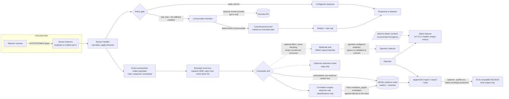
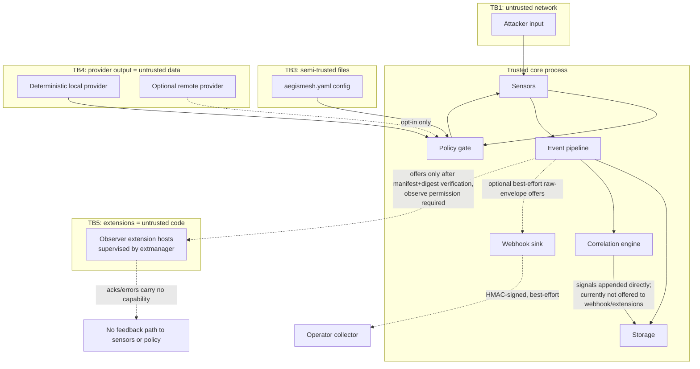
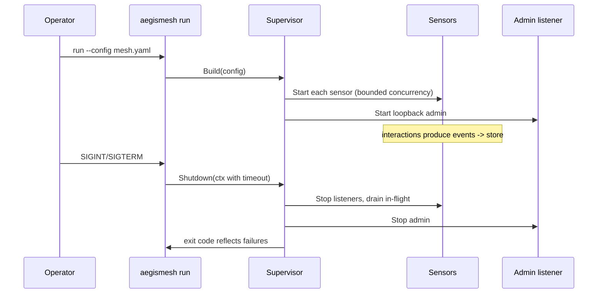

# Architecture and data flow

Version: 0.1.0. Single Go module `github.com/metaforismo/aegismesh`, single binary `aegismesh`.

## Component map

```text
cmd/aegismesh          entrypoint; wires config -> runtime -> admin -> cli
internal/cli           command dispatch, output rendering (human/JSON), errors
internal/config        schema-versioned load/validate/env-override/migrate hooks
internal/runtime       supervisor: sensor lifecycle, bounded event bus, graceful shutdown
internal/sensor        Sensor interface + registry
  /httpsensor          HTTP deception sensor (net/http, hardened server)
  /tcpsensor           TCP deception sensor (banner + line protocol)
  /mcpsensor           MCP decoy endpoint (JSON-RPC 2.0 over streamable HTTP POST)
internal/policy        response policy gate: static rules, provider fallback, redaction choke point
internal/detect        prompt-injection/abuse rule engine (PI-*/EXF-*/ESC-*/OBS-*/RES-* findings)
internal/llm           Provider interface; deterministic local provider + remote `openai`/`ollama` adapters
internal/egress        destination classifier shared by validate, LLM providers, and the webhook sink
internal/event         versioned envelope, redaction, integrity hashing, bounded bus
internal/storage       JSONL append-only store, rotation, retention, export
internal/ecsexport     deterministic ECS-compatible read-boundary projection
internal/correlate     bounded multi-event correlation engine (COR-001..COR-004 signals)
internal/webhook       signed best-effort evidence stream to an operator-configured collector
internal/extmanager    supervised data-only observer extensions (`observe` permission only)
internal/rulecatalog   read-only catalog of every emit-able rule (detection + correlation)
internal/ruletest      offline detection evaluator behind read-only `rules test`
internal/observe       in-process metrics registry served by admin /metrics
internal/admin         loopback listener: /healthz /readyz /metrics /version
internal/ext           extension manifest schema, digest/signature verifier, subprocess host
internal/migrate       clean-room importers (beelzebub YAML shapes)
```

## Runtime data flow



After the authoritative store append, the composite sink (`internal/runtime.evidenceSink`) offers every raw
envelope to enabled consumers in a fixed order: observer extensions (`Deliver`), webhook stream (`Offer`),
correlation (`observe`). Each offer is non-blocking with its own drop counter; none can slow or fail the
store path.

**Known wiring gap:** fired correlation signals are persisted by appending directly to the primary store,
bypassing the bus and the composite sink. Signals therefore reach neither the webhook stream nor observer
extensions today. That fan-out is deferred work, not shipped behavior; correlation signals and raw
interactions are not delivered symmetrically, and nothing here should be read as claiming they are.
Signals remain observations only — no path from any signal influences decoy behavior or policy.

## Trust boundary diagram



## Lifecycle



## Operational edges

Helm liveness/readiness probes are exec probes running `aegismesh healthcheck` (works on the shell-less
distroless image). The command GETs `/healthz`/`/readyz` on the loopback admin listener derived from the
same strict config as the runtime; the verdict is the exit code and body content never influences it.
Outbound observer edges lead only to operator-configured destinations: the webhook sink re-classifies
every dial target against `internal/egress` at connect time, and extension hosts run as separate
processes supervised by `internal/extmanager`.

## Invariants (enforced in code)

1. Every sensor response originates from validated config or from a provider whose output passes the same
   redaction/size pipeline as attacker input.
2. No code path exists from inbound bytes or provider text to `os/exec`, file writes outside the configured
   data dir, or configuration mutation at runtime.
3. The event bus never blocks sensors indefinitely: fixed capacity, explicit overflow counter.
4. Default bind is `127.0.0.1` and port >1024; overrides require validation that fails closed with an
   actionable error.
5. Redaction happens once, at event construction, inside the policy/sensor layer — storage trusts nothing.
6. Derived evidence cannot re-enter its own pipeline: the correlation gate rejects `correlation_signal`
   envelopes, and fired signals append straight to the primary store without traversing the bus.
7. Observer consumers (webhook, extensions, correlation) are strictly read-side: their failures, drops,
   replies, or outputs can never slow an evidence write, alter a decoy response, or mutate configuration.
   Fired signals reach only the store today; delivering signals to webhook/extensions is deferred and
   unimplemented.
8. Producer offers hold a shared lifecycle lock from the closed-state check through the non-blocking send;
   shutdown closes each queue only under the exclusive lock and waits after releasing it. Global runtime
   shutdown is guarded by `sync.Once`.
